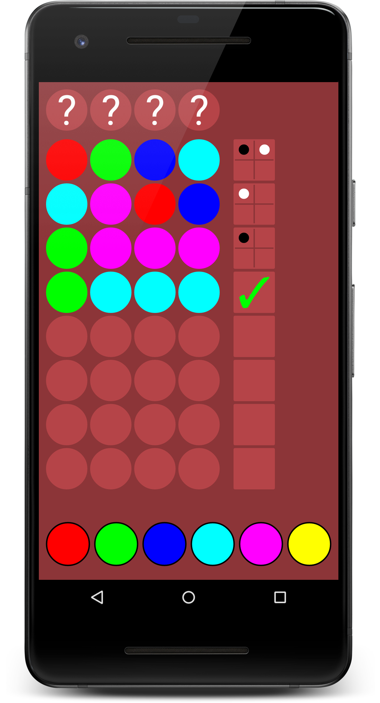
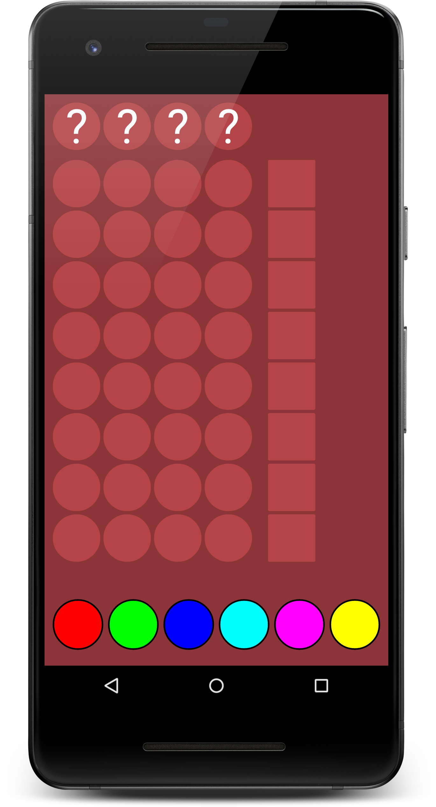
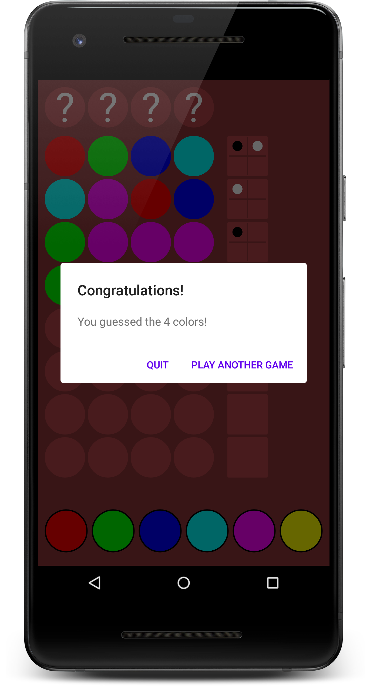
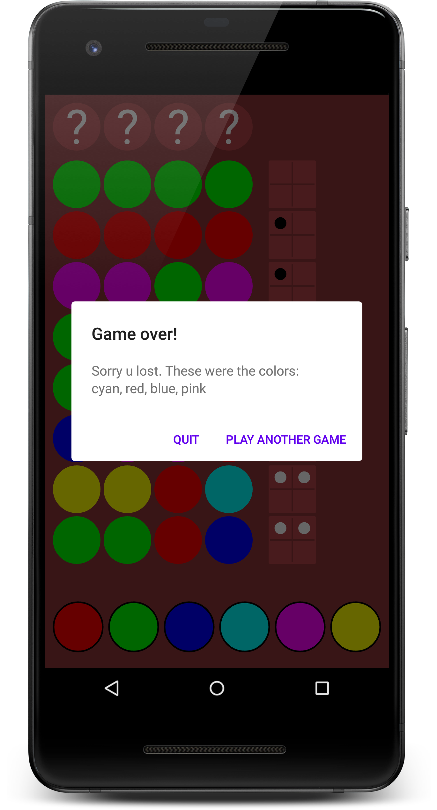
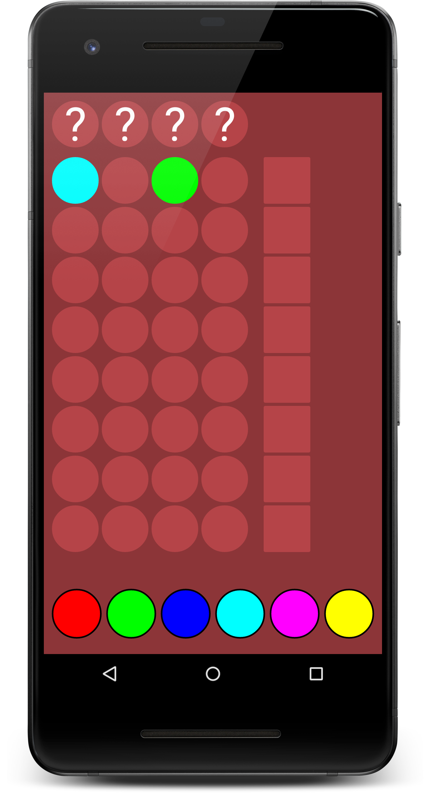

# **Mastermind**
Another Mastermind Android game written in Kotlin. UI images generated with Canvas during running. Targeted: Android 5.0 API 25

## Screenshots

## License
Licensed under [GNU General Public License v3.0](LICENSE)